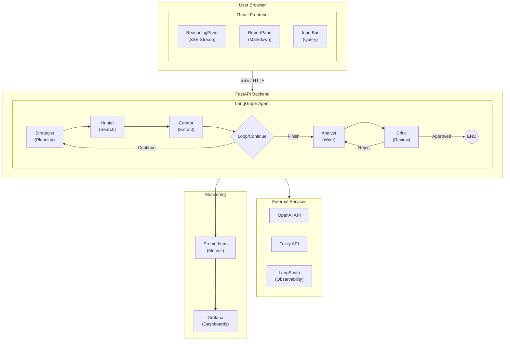
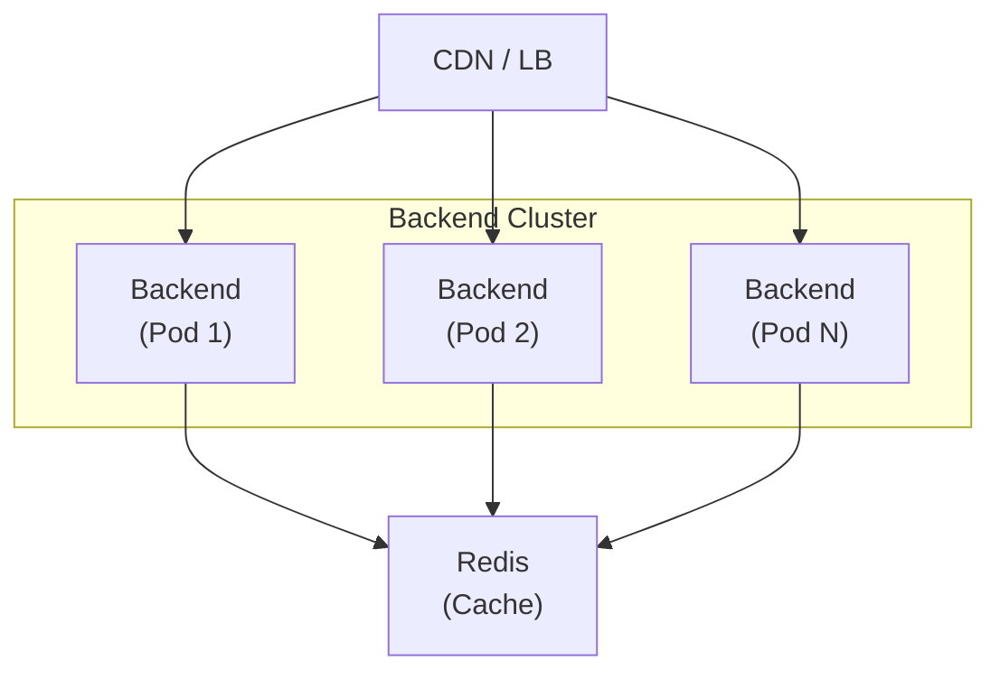

# Architecture Documentation

This document describes the technical design decisions, component interactions, and production considerations for the Deep Research Agent.

## System Overview

The Deep Research Agent is a full-stack application implementing a **Plan-and-Execute** pattern for autonomous research. The system streams its reasoning process to users via Server-Sent Events (SSE), providing unprecedented transparency into AI decision-making.



## Design Decisions

### 1. Plan-and-Execute Pattern

**Decision**: Use a graph-based Plan-and-Execute architecture with specialized nodes.

**Rationale**:
- Separates concerns: planning, execution, curation, synthesis, and review
- Enables iterative refinement through loops
- Each node can be independently tested and optimized
- Natural mapping to observable steps for transparency

**Trade-offs**:
- More complex than single-prompt approaches
- Higher latency due to multi-step processing
- More API calls = higher cost

### 2. Server-Sent Events (SSE) for Streaming

**Decision**: Use SSE over WebSockets for real-time updates.

**Rationale**:
- Simpler implementation than WebSockets for unidirectional streaming
- Native browser support without additional libraries
- Works through proxies and load balancers
- Automatic reconnection handling

**Trade-offs**:
- Unidirectional (server → client only)
- Limited browser connections per domain (6 in HTTP/1.1)
- Less efficient for bidirectional communication

### 3. Atomic Fact Extraction (Curator Node)

**Decision**: Extract atomic facts from raw search results rather than passing full content.

**Rationale**:
- Prevents context window pollution
- Enables deduplication across sources
- Faster subsequent LLM calls with focused context
- Better traceability of claims to sources

**Trade-offs**:
- Information loss during extraction
- Additional LLM call overhead
- Potential extraction errors

### 4. Critique Loop with Bounded Retries

**Decision**: Include a Critic node that can request revisions, with configurable maximum loops.

**Rationale**:
- Catches hallucinations and unsupported claims
- Verifies citation accuracy
- Improves output quality through self-correction
- Bounded to prevent infinite loops

**Trade-offs**:
- Increases latency and cost
- Critic may be overly strict or lenient
- Risk of oscillating between versions

### 5. Dual LLM Strategy

**Decision**: Use a powerful model (gpt-4o) for reasoning and a faster model (gpt-4o-mini) for extraction.

**Rationale**:
- Complex tasks (planning, synthesis, critique) benefit from stronger models
- Simple extraction tasks perform well with smaller models
- Cost optimization: 90%+ reduction in extraction costs
- Latency improvement for high-volume extraction

### 6. uv for Python Dependency Management

**Decision**: Use uv instead of pip/poetry for Python package management.

**Rationale**:
- 10-100x faster than pip
- Built-in virtual environment management
- Deterministic lockfile (uv.lock)
- Excellent Docker integration with caching

### 7. Code Quality & Security Gatekeepers

**Decision**: Enforce strict quality standards using `pre-commit` hooks and GitHub Actions.

**Rationale**:
- **Security**: Prevent accidental commit of private keys (`detect-private-key`)
- **Consistency**: Enforce formatting (`ruff`, `prettier`) before code review
- **Reliability**: Catch type errors (`mypy`) and bugs (`ruff`) early
- **Production Readiness**: "Shift left" on security and quality

---

## Component Details

### Backend Components

#### Agent Nodes

| Node | Responsibility | Model | Input | Output |
|------|----------------|-------|-------|--------|
| Strategist | Analyze task, identify gaps, generate queries | gpt-4o | Task + Gathered Facts | Search Queries |
| Hunter | Execute searches asynchronously | N/A | Search Queries | Raw Results |
| Curator | Extract atomic facts, deduplicate | gpt-4o-mini | Raw Results | Facts |
| Analyst | Synthesize report with citations | gpt-4o | All Facts | Markdown Report |
| Critic | Review for accuracy and completeness | gpt-4o | Report + Facts | Approval/Feedback |

#### State Management

The `ResearchState` TypedDict flows through all nodes:

```python
class ResearchState(TypedDict):
    task: str                           # Original query
    plan: list[str]                     # Current search queries
    gathered_facts: Annotated[...]      # Accumulated facts (additive)
    past_steps: Annotated[...]          # Search history (additive)
    temp_raw_results: list[...]         # Buffer for Hunter → Curator
    iteration_count: int                # Loop counter
    critique_count: int                 # Revision counter
    report_content: str                 # Current report draft
    critique_feedback: str              # Feedback from Critic
    is_approved: bool                   # Approval flag
```

### Frontend Components

| Component | Purpose |
|-----------|---------|
| `Layout` | Split-pane container with header and bottom bar |
| `ReasoningPane` | Streams reasoning log entries with icons and timestamps |
| `ReportPane` | Renders final Markdown report with copy/download |
| `InputBar` | Query input with validation and submit/cancel |
| `StatusIndicator` | Shows current status with animation |

---

## Production Considerations

### Scalability

**Current Design**: Single-container deployment with **Gunicorn** managing concurrent workers.

**For Scale**:
1. **Horizontal Scaling**: Deploy multiple backend instances behind a load balancer (sticky sessions for SSE)
2. **Queue-Based Processing**: Replace synchronous processing with Celery/Redis for long-running research
3. **Caching**: Add Redis for caching search results and extracted facts
4. **CDN**: Serve frontend from a CDN for global edge delivery

### Security

**Current Measures**:
- Non-root Docker user
- CORS configuration
- Input validation with Pydantic
- No secrets in code (environment variables)
- **Hardened Nginx**: CSP, X-Frame-Options, X-Content-Type-Options headers
- **Bandit Analysis**: Automated security linting for Python code

**Production Additions**:
- Rate limiting (per-user, per-IP)
- Authentication (OAuth2, API keys)
- Input sanitization for prompt injection
- Audit logging
- HTTPS termination at load balancer

### Observability

**Current Implementation**:
- **LangSmith**: Integration for LLM call tracing (optional)
- **Prometheus**: Metrics scraping from `/metrics` endpoint via `prometheus-fastapi-instrumentator`
- **Grafana**: Production-grade dashboards with auto-provisioning

**Grafana Dashboards** (10 pre-configured):

| Priority | Dashboard | Purpose |
|----------|-----------|---------|
| 🔴 P0 | Agent Execution Overview | Command center for real-time health |
| 🔴 P0 | LLM Token & Cost Economics | Token tracking and cost estimation |
| 🟠 P1 | Loop Dynamics & Iterations | Research loop analysis |
| 🟠 P1 | Node-Level Performance | Per-node latency and errors |
| 🟡 P2 | Tavily Search Performance | Search API monitoring |
| 🟡 P2 | Quality Assurance Pipeline | Critic node outcomes |
| 🟡 P2 | SSE Stream Health | Real-time streaming health |
| 🟢 P3 | Infrastructure & Resources | Container-level metrics |
| 🟢 P3 | End-to-End Research Timing | Phase breakdown and SLA |
| 🟢 P3 | Business Intelligence | Usage analytics and growth |

**Monitoring Structure**:
```
monitoring/
├── prometheus/
│   └── prometheus.yml          # Prometheus scrape config
└── grafana/
    ├── datasources/
    │   └── datasource.yml      # Auto-configures Prometheus
    ├── provisioning/
    │   └── dashboards/
    │       └── dashboard.yml   # Dashboard provisioning
    └── dashboards/
        └── *.json              # 10 pre-configured dashboards
```

**Production Additions** (Future):
- Distributed tracing (OpenTelemetry)
- Error tracking (Sentry)
- Alerting rules with PagerDuty/Slack integration

### Cost Management

**Strategies**:
1. Use `gpt-4o-mini` for extraction (implemented)
2. Cache Tavily results for repeated queries
3. Limit MAX_ITERATIONS based on user tier
4. Implement token budgets per request
5. Monitor and alert on cost anomalies

### High Availability

**Deployment Pattern**:


---

## Data Flow

### Request Lifecycle

1. User enters query in `InputBar`
2. Frontend POSTs to `/api/v1/research`
3. Backend creates SSE response stream
4. LangGraph executes nodes, emitting events via SSE
5. Frontend parses SSE events, updates `ReasoningPane` and `ReportPane`
6. On completion, full report is available for copy/download

### SSE Event Schema

```json
{
  "event_type": "queries_generated",
  "node": "strategist",
  "data": {
    "queries": ["query1", "query2"]
  },
  "message": "Generated 2 search queries"
}
```

---

## Testing Strategy

### Unit Tests
- Individual node logic
- Edge routing functions
- Service wrappers (mock Tavily, LLM)

### Integration Tests
- Full graph execution with mocks
- API endpoint behavior
- SSE event streaming

### End-to-End Tests (Future)
- Playwright browser tests
- Full stack with real APIs (limited credits)

---

## Future Enhancements

1. **Multi-Modal Research**: Support for image/document analysis
2. **Research History**: Persist and retrieve past research sessions
3. **Collaboration**: Share research sessions with team members
4. **Custom Sources**: Allow users to specify preferred sources/domains
5. **Export Formats**: PDF, DOCX, Notion integration
6. **Feedback Loop**: User feedback to improve future research quality
